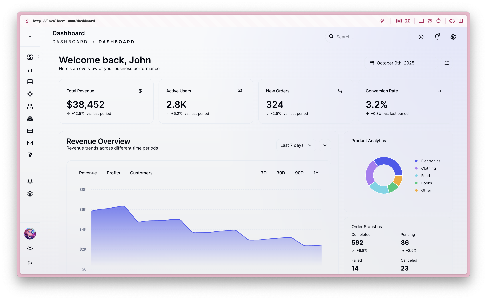
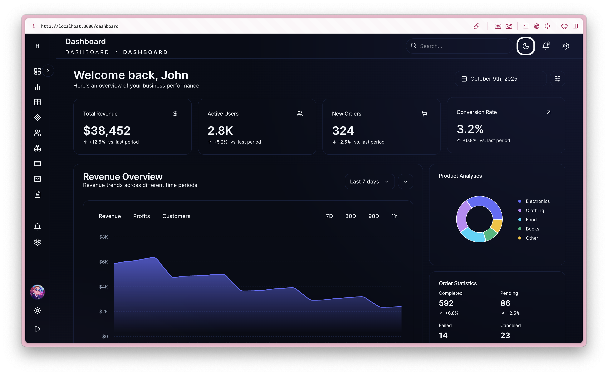
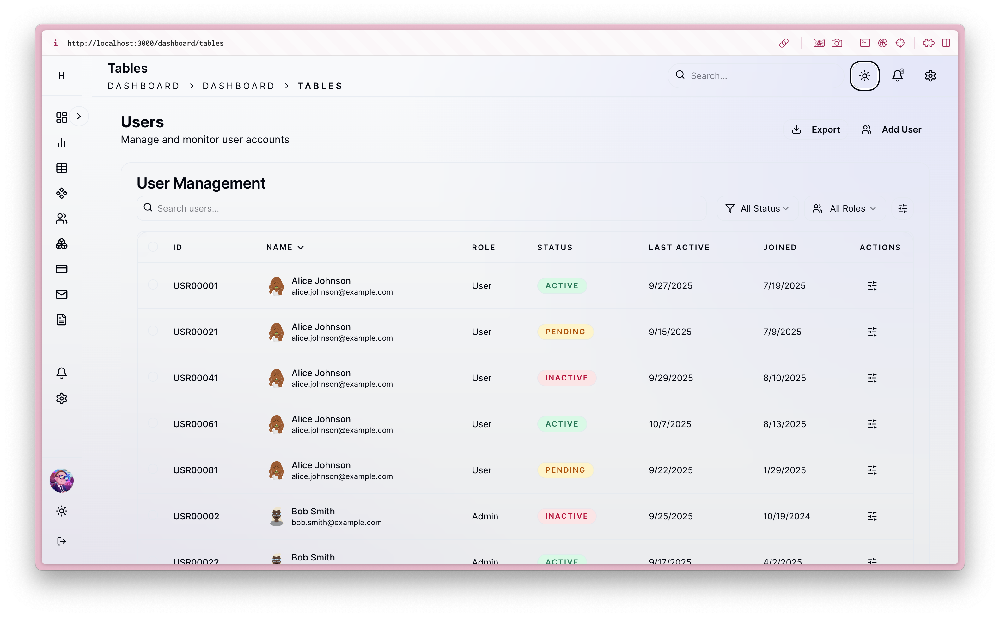

# Haslab UI - Modern Dashboard Template

A sleek, responsive dashboard template built with **Tanstack Start**, **Tailwind CSS v4**, and **shadcn/ui**. Features a modern admin interface with dark mode, interactive charts, and reusable components.





## ✨ Features

- **Tanstack Start** - Modern React framework with file-based routing
- **Tailwind CSS v4** - Latest utility-first CSS framework
- **shadcn/ui** - Accessible, pre-built components
- **TypeScript** - Full type safety throughout the application
- **Responsive Design** - Mobile-first approach with collapsible sidebar
- **Dark/Light Mode** - Theme toggle with persistent preferences
- **Interactive Charts** - Recharts integration for data visualization
- **Data Tables** - Sortable and paginated tables
- **Authentication Pages** - Ready-to-use sign-in/sign-up forms
- **Modern UI Components** - Cards, metrics, notifications, and more

##  🛠️ Tech Stack

- **Framework**: Tanstack Start (React Router)
- **Styling**: Tailwind CSS v4
- **UI Components**: shadcn/ui + Radix UI
- **Charts**: Recharts
- **Forms**: React Hook Form + Zod validation
- **Icons**: Lucide React
- **Build Tool**: Vite
- **Language**: TypeScript

##  🚀 Quick Start

### Prerequisites

- Node.js 18+ 
- npm or yarn

### Installation

1. Clone the repository:
```bash
git clone https://github.com/your-username/haslab-ui.git
cd haslab-ui
```

2. Install dependencies:
```bash
npm install
```

3. Start the development server:
```bash
npm run dev
```

4. Open your browser and navigate to `http://localhost:3000`

### Building for Production

```bash
npm run build
npm start
```

## 📂 Project Structure

```
/
├── app/                    # Application routes and pages
│   ├── dashboard/          # Dashboard pages
│   ├── auth/              # Authentication pages
│   └── __root.tsx         # Root layout
├── components/            # Reusable UI components
│   ├── ui/               # Base UI components (shadcn/ui)
│   ├── dashboard/        # Dashboard-specific components
│   └── theme/            # Theme provider and utilities
├── lib/                  # Utilities and shared logic
└── screenshot/           # Project screenshots
```

##  Customization

### Colors and Theme

Edit the CSS variables in `app/globals.css` to customize the color scheme:

```css
:root {
  --color-primary: hsl(235 85% 62%);
  --color-background: hsl(215 33% 98%);
  /* ... more variables */
}
```

### Adding New Components

Use the shadcn CLI to add new components:

```bash
npx shadcn@latest add [component-name]
```

### Styling Components

All components use Tailwind CSS classes and CSS custom properties for consistent theming.

##  🔧 Development

### Available Scripts

- `npm run dev` - Start development server
- `npm run build` - Build for production
- `npm run start` - Start production server

### CSS Structure

The project uses Tailwind CSS v4 with CSS custom properties for theming. The styling is organized in:

- Global styles in `app/globals.css`
- Component-specific styles using Tailwind classes
- Dark mode support via CSS custom properties

## 📊 Dashboard Features

### Pages Included

- **Dashboard Overview** - Main dashboard with metrics and charts
- **Analytics** - Data visualization and analytics
- **Tables** - Data tables with sorting and pagination
- **Settings** - Configuration and preferences
- **Authentication** - Sign in and sign up pages

### Components

- **Header** - Navigation with breadcrumbs and search
- **Sidebar** - Collapsible navigation menu
- **Metric Cards** - Display key metrics with trends
- **Charts** - Revenue, sales, and product analytics
- **Notification System** - Toast notifications
- **Theme Toggle** - Dark/light mode switching

##  🤝 Contributing

Contributions are welcome! Please feel free to submit a Pull Request.

1. Fork the project
2. Create your feature branch (`git checkout -b feature/AmazingFeature`)
3. Commit your changes (`git commit -m 'Add some AmazingFeature'`)
4. Push to the branch (`git push origin feature/AmazingFeature`)
5. Open a Pull Request

##  📄 License

This project is licensed under the MIT License - see the [LICENSE](LICENSE) file for details.

##  🙏 Acknowledgments

- [Tanstack](https://tanstack.com/) for the amazing React framework
- [Tailwind CSS](https://tailwindcss.com/) for the utility-first CSS framework
- [shadcn/ui](https://ui.shadcn.com/) for the beautiful component library
- [Radix UI](https://www.radix-ui.com/) for accessible primitives
- [Recharts](https://recharts.org/) for chart components

---

Built with  ❤️ using modern web technologies.
